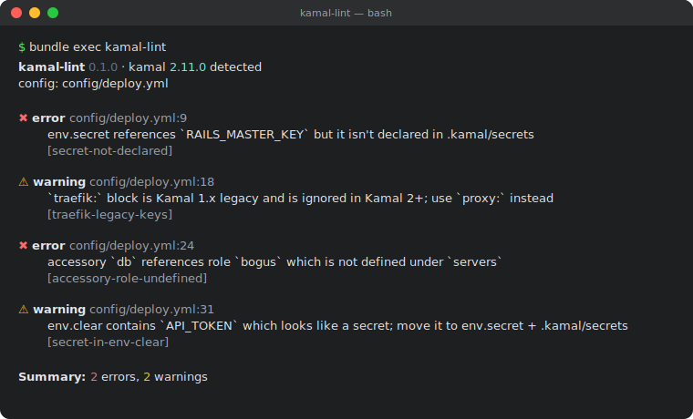

<h1 align="center">kamal-lint</h1>

<p align="center">
  <a href="https://rubygems.org/gems/kamal-lint"></a>
  <a href="https://github.com/davafons/kamal-lint/actions/workflows/ci.yml"></a>
  <a href="https://github.com/davafons/kamal-lint/blob/main/MIT-LICENSE"></a>
  <a href="https://rubygems.org/gems/kamal-lint"></a>
</p>

Static linter for [Kamal](https://kamal-deploy.org) `config/deploy.yml`. Catches missing secrets, role/registry mismatches, and proxy footguns that Kamal silently allows.

<p align="center">
  
</p>

## Install

```ruby
# Gemfile
group :development, :test do
  gem "kamal-lint", require: false
end
```

```bash
bundle exec kamal-lint
```

## Checks

| ID | Severity | Autofix |
|---|---|---|
| `secret-not-declared` | error | |
| `accessory-role-undefined` | error | |
| `role-hosts-empty` | error | |
| `image-registry-mismatch` | error | |
| `builder-registry-secret-undeclared` | error | |
| `ssl-without-host` | error | |
| `empty-web-role` | error | |
| `accessory-placement-missing` | error | |
| `missing-service-name` | error | ✓ |
| `traefik-legacy-keys` | warning | ✓ |
| `boot-limit-exceeds-hosts` | warning | |
| `kamal-secrets-not-gitignored` | warning | ✓ |
| `secret-in-env-clear` | warning | |
| `missing-proxy-healthcheck` | warning | |
| `accessory-image-latest` | warning | |
| `registry-without-explicit-server` | warning | |
| `kamal-parse-error` | error | |  *(opt-in via `--include-kamal-errors`)* |

`kamal-lint list-checks` shows the full table including `since:` version.

## Flags

```
-c, --config-file PATH      config/deploy.yml
-d, --destination NAME      lint deploy.<name>.yml merged onto base
-f, --format FORMAT         human | json | github
    --fail-on LEVEL         error | warning | info
    --fix                   apply safe autofixes
    --kamal-version VER     override detected Kamal version
    --include-kamal-errors  also surface Kamal's loader errors
```

Exit: `0` clean · `1` findings at/above `--fail-on` · `2` config missing.

## Autofix

`--fix` rewrites safe issues in-place (re-serializes YAML, comments are lost). Run on a clean tree, review the diff. Risky transforms (e.g. moving `env.clear` values to `env.secret`) stay manual on purpose.

## CI

```yaml
- uses: davafons/kamal-lint@v0.1.0
  with:
    destination: production
    fail-on: warning
```

`--format=github` is set automatically; findings show as inline annotations.

## Kamal versions

| kamal-lint | kamal |
|---|---|
| `0.1.x` | `>= 2.0`, `< 3.0` |

`kamal-lint` reuses your installed Kamal's loader, so the parse layer auto-tracks `Gemfile.lock`. Override with `--kamal-version 2.5.0` for matrix runs.

## Development

```bash
bin/setup     # install
bin/test      # run tests
bin/console   # IRB with kamal-lint loaded
```

Contributions: see [CONTRIBUTING.md](./CONTRIBUTING.md). License: [MIT](./MIT-LICENSE).
